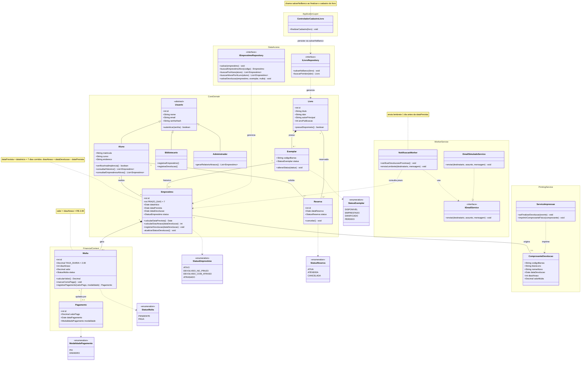

# Preciso repetir que este é o diagrama de classes?

```mermaid
classDiagram
    direction TB

    namespace CoreDomain {
        class Usuario {
            <<abstract>>
            +int id
            +String nome
            +String email
            +String senhaHash
            +autenticar(senha) boolean
        }
        class Aluno {
            +String matricula
            +String curso
            +String endereco
            +verificarInadimplencia() boolean
            +consultarHistorico() List~Emprestimo~
            +consultarEmprestimosAtivos() List~Emprestimo~
        }
        class Bibliotecario {
            +registrarEmprestimo()
            +registrarDevolucao()
        }
        class Administrador {
            +gerarRelatorioAtrasos() List~Emprestimo~
        }
        class Livro {
            +int id
            +String titulo
            +String isbn
            +String autorPrincipal
            +int anoPublicacao
            +possuiDisponiveis() boolean
        }
        class Exemplar {
            +String codigoBarras
            +StatusExemplar status
            +alterarStatus(status) void
        }
        class Reserva {
            +int id
            +Date dataReserva
            +StatusReserva status
            +cancelar() void
        }
        class Emprestimo {
            +int id
            +int PRAZO_DIAS = 7
            +Date dataInicio
            +Date dataPrevista
            +Date dataDevolucao
            +StatusEmprestimo status
            +calcularDataPrevista() Date
            +calcularDiasAtraso(dataDevolucao) int
            +registrarDevolucao(dataDevolucao) void
            -atualizarStatusDevolucao() void
        }
    }

    namespace DataAccess {
        class ILivroRepository {
            <<interface>>
            +salvarNoBanco(livro) void
            +buscarPorIsbn(isbn) Livro
        }
        class IEmprestimoRepository {
            <<interface>>
            +salvar(emprestimo) void
            +buscarEmprestimoAtivo(codigo) Emprestimo
            +buscarPorAluno(aluno) List~Emprestimo~
            +buscarAtivosPorALuno(aluno) List~Emprestimo~
            +salvarDevolucao(emprestimo, exemplar, multa) void
        }
    }

    namespace ApplicationLayer {
        class ControladorCadastroLivro {
            +finalizarCadastro(livro) void
        }
    }

    namespace FinancialContext {
        class Multa {
            +int id
            +Decimal TAXA_DIARIA = 2.00
            +int diasAtraso
            +Decimal valor
            +StatusMulta status
            +calcularValor() Decimal
            +marcarComoPaga() void
            +registrarPagamento(valorPago, modalidade) Pagamento
        }
        class Pagamento {
            +int id
            +Decimal valorPago
            +Date dataPagamento
            +ModalidadePagamento modalidade
        }
    }

    namespace PrintingService {
        class ComprovanteDevolucao {
            +String codigoBarras
            +String tituloLivro
            +String nomeAluno
            +Date dataDevolucao
            +int diasAtraso
            +Decimal valorMulta
        }
        class ServicoImpressao {
            +aoFinalizarDevolucao(evento) void
            +imprimirComprovanteFisico(comprovante) void
        }
    }

    namespace WorkerService {
        class NotificacaoWorker {
            +verificarDevolucoesProximas() void
            +enviarLembrete(destinatario, mensagem) void
        }
        class IEmailService {
            <<interface>>
            +enviar(destinatario, assunto, mensagem) void
        }
        class EmailSimuladoService {
            +enviar(destinatario, assunto, mensagem) void
        }
    }

    class StatusExemplar {
        <<enumeration>>
        DISPONIVEL
        EMPRESTADO
        DANIFICADO
        PERDIDO
    }
    class StatusEmprestimo {
        <<enumeration>>
        ATIVO
        DEVOLVIDO_NO_PRAZO
        DEVOLVIDO_COM_ATRASO
        ATRASADO
    }
    class StatusMulta {
        <<enumeration>>
        PENDENTE
        PAGA
    }
    class ModalidadePagamento {
        <<enumeration>>
        PIX
        DINHEIRO
    }
    class StatusReserva {
        <<enumeration>>
        ATIVA
        ATENDIDA
        CANCELADA
    }

    %% Herança
    Usuario <|-- Aluno
    Usuario <|-- Bibliotecario
    Usuario <|-- Administrador

    %% Relacionamentos do domínio
    Livro "1" *-- "0..*" Exemplar : possui
    Aluno "1" -- "0..*" Emprestimo : realiza
    Exemplar "1" -- "0..*" Emprestimo : historico
    Aluno "1" -- "0..*" Reserva : solicita
    Livro "1" -- "0..*" Reserva : reservada
    Emprestimo "1" *-- "0..1" Multa : gera
    Multa "1" -- "0..1" Pagamento : quitada por
    Emprestimo "1" -- "0..1" ComprovanteDevolucao : origina

    %% Dependências entre contextos
    ControladorCadastroLivro ..> ILivroRepository : persiste via salvarNoBanco
    ILivroRepository ..> Livro : gerencia
    IEmprestimoRepository ..> Emprestimo : gerencia
    ServicoImpressao ..> ComprovanteDevolucao : imprime
    NotificacaoWorker ..> Emprestimo : consulta prazo
    NotificacaoWorker ..> IEmailService : usa
    EmailSimuladoService ..|> IEmailService

    %% Enumerações
    Exemplar ..> StatusExemplar
    Emprestimo ..> StatusEmprestimo
    Multa ..> StatusMulta
    Pagamento ..> ModalidadePagamento
    Reserva ..> StatusReserva

    %% Regras de negócio
    note for Emprestimo "dataPrevista = dataInicio + 7 dias corridos. diasAtraso = dataDevolucao − dataPrevista"
    note for Multa "valor = diasAtraso × R$ 2,00"
    note for NotificacaoWorker "envia lembrete 1 dia antes da dataPrevista"
    note for ControladorCadastroLivro "chama salvarNoBanco ao finalizar o cadastro do livro"
```